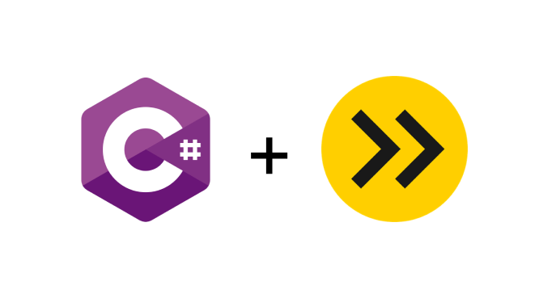
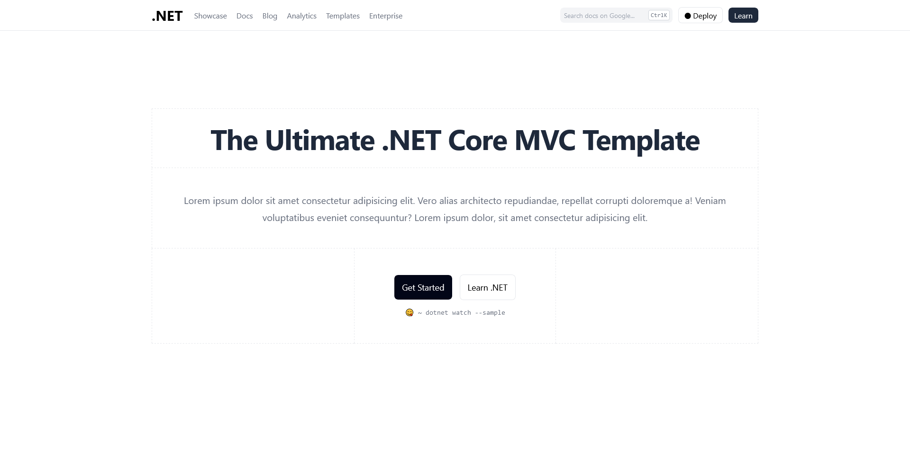

<a name="readme-top"></a>

<!-- PROJECT SHIELDS -->

[![Contributors][contributors-shield]][contributors-url]
[![Forks][forks-shield]][forks-url]
[![Stargazers][stars-shield]][stars-url]
[![Issues][issues-shield]][issues-url]
[![MIT License][license-shield]][license-url]

<!-- PROJECT LOGO -->
<br />
<div align="center">
  <a href="/">
    
  </a>

  <h3 align="center">Delvis Soligt</h3>

  <p align="center">
    The Ultimate .NET Core MVC Template without heavy lib codes!
    <br />
    <a href="https://github.com/data-miner00/DelvisSoligt"><strong>Explore the docs »</strong></a>
    <br />
    <br />
    <a href="https://github.com/data-miner00/DelvisSoligt">View Demo</a>
    ·
    <a href="https://github.com/data-miner00/DelvisSoligt/issues">Report Bug</a>
    ·
    <a href="https://github.com/data-miner00/DelvisSoligt/issues">Request Feature</a>
  </p>
</div>

<!-- TABLE OF CONTENTS -->
<details>
  <summary>Table of Contents</summary>
  <ol>
    <li>
      <a href="#about-the-project">About The Project</a>
      <ul>
        <li><a href="#built-with">Built With</a></li>
        <li><a href="#design">Design</a></li>
      </ul>
    </li>
    <li>
      <a href="#getting-started">Getting Started</a>
      <ul>
        <li><a href="#prerequisites">Prerequisites</a></li>
        <li><a href="#installation">Installation</a></li>
      </ul>
    </li>
    <li><a href="#usage">Usage</a></li>
    <li><a href="#roadmap">Roadmap</a></li>
    <li><a href="#contributing">Contributing</a></li>
    <li><a href="#license">License</a></li>
    <li><a href="#acknowledgments">Acknowledgments</a></li>
  </ol>
</details>

<!-- ABOUT THE PROJECT -->

## About The Project



A lightweight template for building .NET Core MVC applications with a full JavaScript ecosystem available.

Incentives:

- Wanted to have a more lightweight, versatile .NET Core MVC template
- Don't want to use the original MVC template
- Want to use TailwindCSS
- Buitl this MVC template so I can use it for other projects.

Of course, no one template will serve all projects since your needs may be different. So I'll be adding more in the near future. You may also suggest changes by forking this repo and creating a pull request or opening an issue. Thanks to all the people who have contributed to expanding this template!

<p align="right">(<a href="#readme-top">back to top</a>)</p>

### Built With

The technologies and tools used within this template.

- .NET MVC
- C#/Razor
- Esbuild
- JavaScript
- TypeScript
- TailwindCSS
- Selenium (Need regularly update Chrome driver NuGet)
- xUnit

<p align="right">(<a href="#readme-top">back to top</a>)</p>

<!-- DESIGN -->

### Design

.NET MVC is a server-side web application framework. The official MVC template from Microsoft comes with a huge JavaScript and BootStrap library which I think it is cumbersome to maintain. I swapped the library with Node and npm build tools, in this case, esbuild to perform code splitting and bundling. It also supports transpilation from TypeScript to JavaScript and this makes the codebase more versatile and lightweight. Additionally, I can use TailwindCSS to style the web UIs which is extremely handy.

<p align="right">(<a href="#readme-top">back to top</a>)</p>

<!-- GETTING STARTED -->

## Getting Started

### Prerequisites

The list of tools that are used when development.

- npm
  ```sh
  npm install npm@latest -g
  ```
- Pnpm
  ```sh
  npm i -g pnpm
  ```
- [Git](https://git-scm.com/downloads)
- [.NET CLI](https://dotnet.microsoft.com/en-us/download)

### Installation

_To use this template for personal use or contribution, simply perform the following._ A total of **2 terminals** are required to get the core components of the application up and running for development.

1. Clone the repo
   ```sh
   git clone https://github.com/data-miner00/DelvisSoligt.git
   ```
2. Install Node dependencies
   ```sh
   pnpm i
   ```
3. Install NuGet dependencies
   ```sh
   dotnet restore
   ```
4. Change directory into `DelvisSoligt.Web`
   ```sh
   cd src/DelvisSoligt.Web
   ```
5. Optionally build TailwindCSS
   ```sh
   pnpm build:css
   ```
6. Optionally build JavaScript from TypeScript
   ```sh
   pnpm build:js
   ```
7. Watch TailwindCSS
   ```sh
   pnpm watch:css
   ```
8. Start or watch MVC project
   ```sh
   dotnet run
   # or
   dotnet watch
   ```
9. Build MVC project
   ```sh
   dotnet build
   ```

<p align="right">(<a href="#readme-top">back to top</a>)</p>

<!-- ROADMAP -->

## Roadmap

- [x] TypeScript integration
- [ ] Unit Test
- [ ] Mobile responsive
- [x] Working navigation
- [x] Selenium UI test
- [ ] Fix Div soup
- [ ] Add fonts
- [ ] Authorization
- [x] jQuery

See the [open issues](https://github.com/data-miner00/DelvisSoligt/issues) for a full list of proposed features (and known issues).

<p align="right">(<a href="#readme-top">back to top</a>)</p>

<!-- CONTRIBUTING -->

## Contributing

Contributions are what makes the open-source community such an amazing place to learn, inspire, and create. Any contributions you make are **greatly appreciated**.

If you have a suggestion that would make this better, please fork the repo and create a pull request. You can also simply open an issue with the tag "enhancement".
Don't forget to give the project a star! Thanks again!

1. Fork the Project
2. Create your Feature Branch (`git checkout -b feature/AmazingFeature`)
3. Commit your Changes (`git commit -m 'Add some AmazingFeature'`)
4. Push to the Branch (`git push origin feature/AmazingFeature`)
5. Open a Pull Request

<p align="right">(<a href="#readme-top">back to top</a>)</p>

<!-- LICENSE -->

## License

Distributed under the GPL3.0 License. See `LICENSE` for more information.

<p align="right">(<a href="#readme-top">back to top</a>)</p>

<!-- ACKNOWLEDGMENTS -->

## Acknowledgments

List of resources that are helpful and would like to give credit to.

- [Nextjs](https://nextjs.org/)
- [esbuild homepage](https://esbuild.github.io/)
- [.NET Documentation](https://learn.microsoft.com/en-us/dotnet/)

<p align="right">(<a href="#readme-top">back to top</a>)</p>

<!-- MARKDOWN LINKS & IMAGES -->

[contributors-shield]: https://img.shields.io/github/contributors/data-miner00/DelvisSoligt.svg?style=for-the-badge
[contributors-url]: https://github.com/data-miner00/DelvisSoligt/graphs/contributors
[forks-shield]: https://img.shields.io/github/forks/data-miner00/DelvisSoligt.svg?style=for-the-badge
[forks-url]: https://github.com/data-miner00/DelvisSoligt/network/members
[stars-shield]: https://img.shields.io/github/stars/data-miner00/DelvisSoligt.svg?style=for-the-badge
[stars-url]: https://github.com/data-miner00/DelvisSoligt/stargazers
[issues-shield]: https://img.shields.io/github/issues/data-miner00/DelvisSoligt.svg?style=for-the-badge
[issues-url]: https://github.com/data-miner00/DelvisSoligt/issues
[license-shield]: https://img.shields.io/github/license/data-miner00/DelvisSoligt.svg?style=for-the-badge
[license-url]: https://github.com/data-miner00/DelvisSoligt/blob/master/LICENSE
